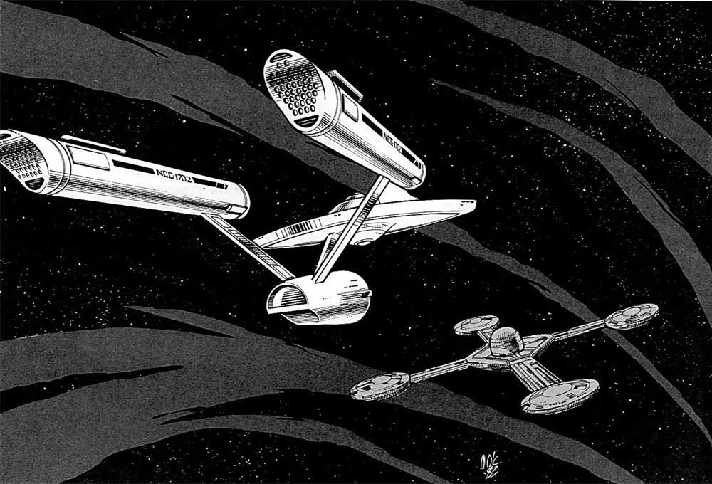

# {{ title }}

These lists are built so you can make characters at different levels. They’re cumulative, so you would use Starfleet Academy to make a cadet, and then add a branch school after that to make a fresh ensign. Department Head School is for... department heads, and officers in line for command would go to Command School.


