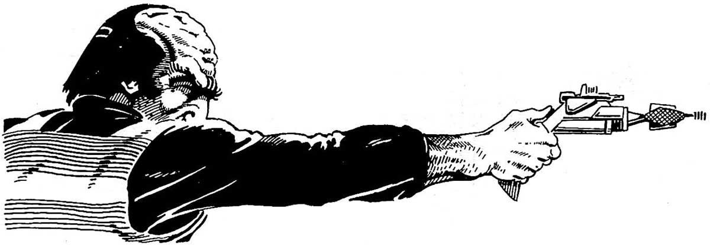

# {{ title }}

I’m using Endurance Reserves instead of charges for energy weapons because players can be clever and eventually somebody is going to ask me just how much power is left in a particular power pack.

The size of the Endurance Reserves was determined by how it might relate to a game. If you have bunches of shots, then you’ll never be out of power during a story. We’ll see how these numbers work first, and then maybe change them later if needed.


